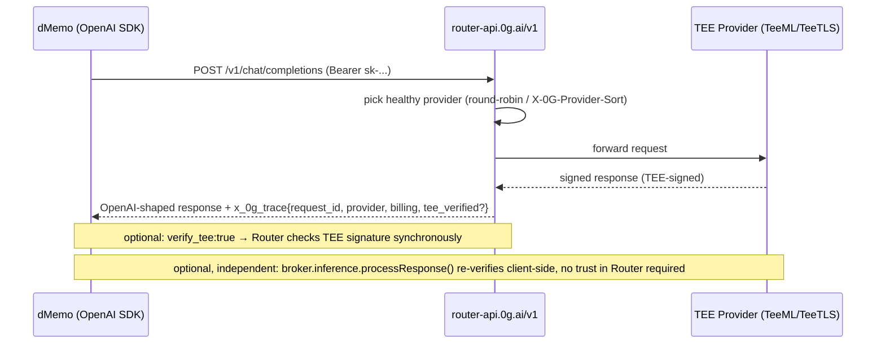

# 0G Compute / 0G Private Computer (pc.0g.ai) — Research Report

Scope: inference API surface, setup flow, streaming, model list, and TEE verification for
`https://pc.0g.ai` / `docs.0g.ai` (0G Compute Network). Researched for dMemo's decision on how
to call an LLM through 0G Compute for private inference.

Sources: `docs.0g.ai` (Developer Hub → Compute Network → Router, and → Direct) fetched
2026‑07‑24, plus the `@0gfoundation/0g-compute-ts-sdk` source (cloned to
`/private/tmp/.../scratchpad/repos/0g-compute-ts-sdk`, npm `0.9.0`, formerly published as
`@0glabs/0g-serving-broker`). All URLs cited inline; SDK claims cite `file:line`.

---

## (a) High-level overview

0G Compute exposes **two separate integration paths** to the same underlying TEE provider
network. They have different balances, different auth, and different amounts of custom code
required.

```
                         ┌────────────────────────────────────────────┐
                         │              0G Compute Network             │
                         │   (GPU providers, each running inside a     │
                         │    TEE: TeeML = model-in-TEE, TeeTLS =      │
                         │    broker-in-TEE proxying to a centralized  │
                         │    LLM API)                                 │
                         └───────────────▲──────────────▲─────────────┘
                                          │              │
                    ┌─────────────────────┘              └───────────────────┐
                    │                                                        │
        ┌───────────┴───────────┐                              ┌────────────┴───────────┐
        │   ROUTER (recommended) │                              │   DIRECT (advanced)    │
        │ router-api.0g.ai/v1    │                              │  per-provider .../v1/proxy │
        │ hosted gateway         │                              │  you call providers     │
        │                        │                              │  yourself, wallet-signed│
        └───────────▲────────────┘                              └────────────▲───────────┘
                     │ Authorization: Bearer sk-...                          │ Authorization: Bearer app-sk-<wallet-signed session token>
                     │ (plain API key, no wallet call per request)           │ (SDK signs every request with your EVM wallet)
                     │                                                       │
              ┌──────┴──────┐                                        ┌───────┴───────┐
              │ Your server │                                        │ Your server /  │
              │  (dMemo)    │                                        │ browser dApp    │
              └─────────────┘                                        └────────────────┘
```

Router request flow (the path we recommend, see §c):



---

## (b) Key decisions and why

| Decision | Recommendation | Why (with reference) |
|---|---|---|
| Which integration path | **Router**, not Direct SDK | Router is "drop-in": "change `base_url` and `api_key`, nothing else" against the OpenAI SDK — no wallet, no signing, no ledger management in the request path ([Router Overview](https://docs.0g.ai/developer-hub/building-on-0g/compute-network/router/overview)). Direct requires an `ethers` wallet, on-chain ledger + per-provider sub-account funding, and manual header signing for every call ([Inference (Direct)](https://docs.0g.ai/developer-hub/building-on-0g/compute-network/inference)). Matches dMemo's "minimal setup steps" value prop. |
| Package | `@0gfoundation/0g-compute-ts-sdk` (only if we need Direct/verification helpers) | `@0glabs/0g-serving-broker` is **deprecated** and now just re-exports the new package (`0g-compute-ts-sdk/README.md:3`). Don't add the old name to new code. |
| Don't hand-roll signing/verification | Use the SDK's `broker.inference.processResponse()` rather than re-implementing EIP-191 verification | The SDK already implements chain lookup → fetch signature → `ethers.recoverAddress` verification (`verifier.ts:883-893`, `request.ts` `getServiceMetadata`/`getRequestHeaders`). Docs explicitly offer this as the "recommended" way to independently verify, vs. a 4-step manual protocol for languages without the SDK ([Verifiable Execution](https://docs.0g.ai/developer-hub/building-on-0g/compute-network/router/features/verifiable-execution)). |
| Privacy tier | Set `X-0G-Provider-Trust-Mode: private` (or the API key's default trust mode) rather than trusting "standard" | `private` restricts routing to **TeeML** providers only — the model runs inside the TEE, "prompts never leave the enclave" ([Privacy & ZDR](https://docs.0g.ai/developer-hub/building-on-0g/compute-network/router/privacy)). This is the mode that actually matches dMemo's "private LLM inference" pitch; `standard` (the default) only guarantees *some* TEE-backed provider with no independent verifiability disclosed. |
| Verification depth | Use `verify_tee: true` for logging/audit; use SDK `processResponse()` only if we need zero-trust-in-Router proof | `verify_tee:true` is one flag, Router does the check and reports `tee_verified` in `x_0g_trace` — "you still have to trust the Router to have done the check honestly." Full independent verification needs the SDK/wallet round-trip and is heavier ([Verifiable Execution](https://docs.0g.ai/developer-hub/building-on-0g/compute-network/router/features/verifiable-execution)). For dMemo's "trust me" bar, `verify_tee` synchronous flag is probably sufficient; keep the SDK path as an opt-in escalation, not the default — avoids adding a wallet dependency to the default request path. |
| No custom retry/routing logic | Rely on Router's built-in failover, don't build our own provider pool | Router already does round-robin + failover + `X-0G-Provider-Sort: latency|price` + price ceilings natively ([Provider Routing](https://docs.0g.ai/developer-hub/building-on-0g/compute-network/router/routing)). The SDK repo even ships a *reference* self-hosted router (`src.ts/example/router-server.ts`) — we should NOT reimplement this; it's an example of what 0G's hosted Router already does for you. **Qualified by spike (live testnet, 2026-07)**: this holds for the **Router** path only — the **Direct** provider path has no such failover and needs its own client-side retry/backoff (see §d). |

---

## (c) API surface — exact facts

### Base URLs

| Network | Router endpoint (recommended) | Direct SDK RPC |
|---|---|---|
| Mainnet | `https://router-api.0g.ai/v1` | `https://evmrpc.0g.ai` |
| Testnet | `https://router-api-testnet.integratenetwork.work/v1` | `https://evmrpc-testnet.0g.ai` |

Router is fully OpenAI-compatible: `POST /v1/chat/completions`, `POST /v1/images/generations`,
`POST /v1/images/edits`, `POST /v1/audio/transcriptions`, `GET /v1/models`, `GET /v1/providers`.
A `/v1/messages` path also appears in the routing-header applicability table alongside
`/v1/chat/completions` (both grouped under "Chat" service type) — this **is** a genuine Anthropic
Messages API-compatible route, not an internal alias: independently verified against the router's
OpenAPI spec, its Go source (dedicated request/response schemas, Anthropic-dialect reasoning
translation, Anthropic-shaped SSE streaming and rate-limit headers), and live probes (D10, see
`followup-0g-endpoints.md`).

### Auth

| Path | Header | Format | Source |
|---|---|---|---|
| Router — inference calls | `Authorization: Bearer sk-...` | Plain API key, created once in the pc.0g.ai dashboard (or via `POST /v1/api-keys` using an `mk-` key) | [Authentication](https://docs.0g.ai/developer-hub/building-on-0g/compute-network/router/authentication) |
| Router — account/usage/key-mgmt | `Authorization: Bearer mk-...` | Management key, scoped (`account:read`, `keys:read`, `keys:create`, `keys:manage`) | same |
| Direct SDK — per-request | `Authorization: Bearer app-sk-<base64(rawMessage\|signature)>` | Wallet-signed ephemeral (default) or persistent session token, generated by `broker.inference.getRequestHeaders()` / `getHeader()` | `0g-compute-ts-sdk/src.ts/sdk/inference/broker/base.ts:564-577` |

No custom request signing exists on the **Router** path — it is a normal bearer-token API, no
per-request wallet signature, no HMAC. All signing is on the **Direct** path only, done entirely
inside the SDK (you never touch crypto primitives yourself): every `getRequestHeaders()` call
generates/reuses a wallet-signed session token (`base.ts:530-578`).

### Setup flow — true minimum steps

**Router (recommended):**
1. Visit pc.0g.ai, connect wallet (MetaMask/WalletConnect, or Privy social login → embedded wallet) — **one-time, UI/wallet-session only**.
2. Deposit 0G to the Payment Layer contract (Mainnet `0xA3b15Bd2aD18BFB6b5f92D8AA9F444Dd59d1cE32`, Testnet `0x0AD9690e0b34aB2d493DE02cDF149ee34f6C9939`) — this is a plain on-chain tx, **scriptable** with `ethers` + a private key once you have one.
3. Create an `sk-` API key in Dashboard → API Keys (or `POST /v1/api-keys` with an `mk-` key).
4. Point any OpenAI SDK at `base_url=https://router-api.0g.ai/v1`, `api_key=sk-...`.

("Four steps. Five minutes." per [Quickstart](https://docs.0g.ai/developer-hub/building-on-0g/compute-network/router/quickstart).)

**Can it be fully scripted end-to-end, with zero UI interaction?** Not proven from docs alone.
Step 1 (initial wallet connect → first credential) and the *first* management key appear to
require a wallet **sign-in session** — "ANY `/v1/management-keys/*` requires the wallet JWT
(sign-in session)" ([Authentication](https://docs.0g.ai/developer-hub/building-on-0g/compute-network/router/authentication)). Once you hold an `mk-` key, minting/rotating `sk-` keys via
`POST /v1/api-keys` is scriptable. The deposit (step 2) is a normal contract call and is
scriptable with a raw private key. **Open question**: whether the initial wallet JWT / first
`mk-`/`sk-` key can be obtained via a documented non-browser flow (e.g., SIWE-style signature
exchange) — not found in the fetched docs; needs direct testing or asking 0G.

**Direct SDK (only if Router doesn't fit — e.g. need fine-tuning, which Router doesn't offer):**
1. `pnpm add @0gfoundation/0g-compute-ts-sdk`
2. `const broker = await createZGComputeNetworkBroker(wallet)` — fully scriptable, Node.js `ethers.Wallet` from a private key (`broker.ts:66`).
3. `await broker.ledger.depositFund(10)` — min 3 0G to create the ledger (`ledger.ts:189-190`).
4. `await broker.ledger.transferFund(providerAddress, 'inference', 1e18n)` — min 1 0G per provider, **auto-acknowledges** the provider's TEE signer as a side effect (`request.ts:174-212`, confirmed in docs: "This also auto-acknowledges the provider's TEE signer on-chain").
5. `getServiceMetadata()` → `getRequestHeaders()` → `fetch(...)`.

This path is **fully scriptable in Node.js** with just a private key — no browser, no manual
steps. In Node the SDK offers `startAutoFunding()` background top-ups so you don't hand-manage
balances per call (`base.ts:746-853`). In a browser it explicitly disables auto-funding to avoid
surprise wallet popups (`base.ts:820-828`), so browser dApps must fund manually — not relevant
to dMemo's server-side use case.

### Streaming

Both paths: OpenAI-format SSE, `"stream": true`. Router: any standard OpenAI client streaming
code works unchanged; reasoning models (e.g. GLM-5) emit `reasoning_content` deltas before final
`content` ([Chat Completions](https://docs.0g.ai/developer-hub/building-on-0g/compute-network/router/features/chat-completions)). Direct: same SSE shape, but if you want to
`processResponse()`-verify a streamed reply you must reassemble the stream to extract `id`
(`chatID`) yourself — the docs give the exact reduce loop ([Inference §Streaming Responses](https://docs.0g.ai/developer-hub/building-on-0g/compute-network/inference)).

### Model list

`GET https://router-api.0g.ai/v1/models` — **no auth required**, OpenAI list format, includes
`pricing.prompt`/`pricing.completion` (neuron per token, `1e18 neuron = 1 0G`), `context_length`,
`provider_count`, and (per the privacy page) a `verifiability` field (`"TeeML"` etc.) you can
filter on to find privacy-tier-eligible models:
```
curl -s https://router-api.0g.ai/v1/models | jq '.data[] | select(.verifiability == "TeeML") | .name'
```
`GET /v1/providers?model=<id>` lists the specific TEE-acknowledged provider addresses serving a
model, for pinning via `X-0G-Provider-Address`.

### TEE / verification steps that alter the normal cycle

| Mechanism | How it's triggered | What changes | Source |
|---|---|---|---|
| Trust-mode routing | `X-0G-Provider-Trust-Mode: standard\|verified\|private` header, or set as API key default | Filters candidate providers *before* routing; `private` restricts to TeeML (model literally runs inside the enclave) | [Routing](https://docs.0g.ai/developer-hub/building-on-0g/compute-network/router/routing), [Privacy](https://docs.0g.ai/developer-hub/building-on-0g/compute-network/router/privacy) |
| Synchronous server-side verify | `"verify_tee": true` in body (or `?verify_tee=true` for multipart) | Router fetches + verifies the TEE signature before responding; adds `tee_verified: true\|false\|null` to `x_0g_trace` in the response | [Verifiable Execution](https://docs.0g.ai/developer-hub/building-on-0g/compute-network/router/features/verifiable-execution) |
| Independent client-side verify | `broker.inference.processResponse(providerAddress, chatID)` after the call | Reads on-chain `teeSignerAddress`, fetches `{url}/v1/proxy/signature/{chatID}`, verifies EIP-191 `personal_sign` — no trust in Router; **any** wallet works (even a throwaway `ethers.Wallet.createRandom()`) since it only reads chain + calls a public endpoint | `verifier.ts:883-893` (`ethers.hashMessage` + `ethers.recoverAddress`), doc example uses `Wallet.createRandom()` |
| `chatID` retrieval | Response header `ZG-Res-Key`, fallback `data.id` | Needed for both verify paths above; for streaming, only available via raw headers (works with `fetch`, needs the "raw response" helper on OpenAI SDKs) | `response.ts:25-106`, Inference docs |

**Open flag (spike, live testnet, 2026-07)**: `inference.processResponse(provider, body.id,
JSON.stringify(body.usage))` threw `"getting signature error"` after an otherwise-successful
completion in the spike run — unresolved whether this is a caller-args issue or provider-side;
flag it before relying on `processResponse()` as the default independent-verification path.

---

## (d) Spike-verified (live testnet, 2026-07)

Live end-to-end run against Galileo testnet (chain 16602), broker path via
`@0gfoundation/0g-compute-ts-sdk@0.9.0` (`c1b-fund-and-chat.mjs`) — facts not derivable from docs
alone:

| Fact | Detail | Source |
|---|---|---|
| Testnet model catalog is 2 models, not the full 23 | Galileo **testnet** serves only `qwen/qwen2.5-omni-7b` (chatbot, TeeML, provider `0xa48f01287233509FD694a22Bf840225062E67836`) and `qwen-image-edit-2511`. The wider 23-model catalog (including `claude-*`) is **mainnet-only** — there are **no Claude models on testnet**. | spike (c1b-fund-and-chat.mjs, live testnet run) |
| Direct provider endpoints are flaky | Direct-path endpoints are Phala-hosted (`*.in1.phala.network`, behind `compute-network-*.integratenetwork.work`). Observed a **~15-minute total outage of all testnet provider endpoints** mid-spike, while the hosted Router (`router-api.0g.ai`) stayed up throughout at **~250ms**. This qualifies the "No custom retry/routing logic" guidance in §b: it holds for the **Router** path only — the **Direct** path has no built-in failover and needs its own client-side retry/backoff; the hosted Router is the sensible fallback. | spike (c1b-fund-and-chat.mjs, live testnet run) |
| Broker method surface confirmed working end-to-end | `createZGComputeNetworkBroker(wallet)` → `ledger.getLedger()` (**throws** if the ledger doesn't exist yet — distinct from a zero-balance ledger) → `ledger.depositFund(3)` (min to create) → `ledger.transferFund(provider, 'inference', 1e18n)` (auto-acks the TEE signer) → `inference.acknowledged(provider)` (**not** `userAcknowledged`) → `getServiceMetadata` → `getRequestHeaders` → plain `fetch` to `${endpoint}/chat/completions` — completion returned in **1204ms**. | spike (c1b-fund-and-chat.mjs, live testnet run), SDK `@0gfoundation/0g-compute-ts-sdk@0.9.0` |

---

## Open questions / unresolved

1. **Fully-scripted zero-UI onboarding**: docs strongly imply the very first credential (wallet
   JWT / first `mk-` key) requires an interactive `pc.0g.ai` sign-in session; no documented
   headless/CI flow (e.g. SIWE) for minting the first key was found. Needs direct API testing or
   a question to 0G Labs.
2. **Router rate limits**: docs deliberately don't publish numbers ("may evolve"), only headers
   (`X-RateLimit-*`, `Retry-After`). The Direct/per-provider path *does* document concrete
   defaults (30 req/min sustained, burst 5, 5 concurrent) — these are provider-side, may not
   equal Router-side limits.
3. **Zero-data-retention claim** ("prompts/completions processed in memory only, never written to
   storage") is asserted in docs, not independently verifiable without `private`-tier TEE
   attestation per request.

## Key files / URLs referenced

- SDK clone: `/private/tmp/claude-501/-Users-tomasdomingos-dMemo/15587102-be28-4ef7-8ec7-35a0239acba5/scratchpad/repos/0g-compute-ts-sdk`
  - `src.ts/sdk/broker.ts:66` — `createZGComputeNetworkBroker`
  - `src.ts/sdk/inference/broker/base.ts:564-577` — Router-style Bearer token construction (Direct path)
  - `src.ts/sdk/inference/broker/base.ts:746-853` — background auto-funding
  - `src.ts/sdk/inference/broker/request.ts:63-212` — `getServiceMetadata`, `getRequestHeaders`, provider acknowledgement
  - `src.ts/sdk/inference/broker/response.ts:25-106` — `processResponse`
  - `src.ts/sdk/inference/broker/verifier.ts:883-893` — EIP-191 signature verification
  - `src.ts/example/router-server.ts` — reference self-hosted router (do NOT reimplement; hosted Router already does this)
  - `src.ts/sdk/ledger/ledger.ts:164-200`, `src.ts/sdk/ledger/broker.ts:171-256` — deposit/transfer
- Docs: `docs.0g.ai/developer-hub/building-on-0g/compute-network/{overview,inference,account-management}`,
  `.../router/{overview,quickstart,principles,authentication,account/deposits,features/chat-completions,
  features/verifiable-execution,routing,models,rate-limits,errors,privacy,comparison,faq}`

---

## Decisions (settled)

| # | Decision | Detail |
|---|---|---|
| D10 | Inference: 0G Router, TeeML-pinned | `router-api.0g.ai/v1`, `X-0G-Provider-Trust-Mode: private`. Claude Code via first-class `/v1/messages`. Codex = memory-only (no `/v1/responses`). See also `followup-0g-endpoints.md` |
