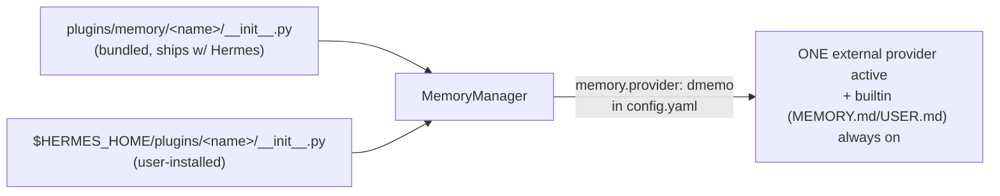

# Hermes Agent — Integration Research for dMemo

**Source:** [github.com/NousResearch/hermes-agent](https://github.com/NousResearch/hermes-agent) (open-source, MIT, by Nous Research), cloned locally at commit `7cd48733db4` (2026-07-24). Docs site: `website/docs/` in-repo → published at [hermes-agent.org](https://hermes-agent.org). Package: `hermes-agent` v0.19.0 on PyPI. Note: `hermes-agent.org` marketing page itself is thin (no architecture/plugin docs) — the actionable detail lives in the repo's `website/docs/` tree and the source.

---

## (a) High-Level Overview

Hermes is a single Python process (CLI + optional gateway) built directly on top of `openai` / `anthropic` SDK clients — **not** LangChain/LlamaIndex/any agent framework. It has a first-class, already-built plugin architecture for external memory providers, which is the highest-leverage integration point for dMemo.

```
┌─────────────────────────────────────────────────────────────────┐
│ Hermes AIAgent (conversation_loop.py)                             │
│                                                                     │
│  Turn N:                                                            │
│   1. MemoryManager.prefetch(query) ──────► dMemo provider.prefetch()│
│        (sync, must be fast; formatted text injected into prompt)   │
│   2. system_prompt_block() injected (static, per-session)          │
│   3. ── LLM call ── (model.provider: "custom", base_url: pc.0g.ai) │
│   4. Tool calls dispatched, incl. dMemo tool schemas if registered  │
│   5. MemoryManager.sync_turn(user, assistant) ──► dMemo provider    │
│        (async write, non-blocking)                                 │
│   6. on_session_end() / on_session_switch() ──► bulk ingest hooks   │
└─────────────────────────────────────────────────────────────────┘
```

Plugin discovery (memory providers specifically):



---

## (b) Key Decisions and Why

### 1. Runtime/SDK — plain Python, direct `openai`/`anthropic` clients

- No agent framework dependency. `pyproject.toml` deps: `openai==2.24.0` (core), `anthropic==0.87.0` (optional extra) — `/Users/…/scratchpad/repos/hermes-agent/pyproject.toml:40,145`.
- Comment in `pyproject.toml:35-38`: "Anything that's provider-specific… Smaller `dependencies` = smaller blast [radius]" — deliberate minimal-dependency philosophy. This matters for dMemo: a fork/plugin shouldn't drag in a heavy stack either.

### 2. Custom model endpoints — YES, native, first-class ("point at 0G Compute")

Hermes explicitly documents: *"Hermes Agent works with any OpenAI-compatible API endpoint… If a server implements `/v1/chat/completions`, you can point Hermes at it."* — `website/docs/integrations/providers.md:568-570`.

Config shape (exactly what's needed to target `pc.0g.ai`):
```yaml
model:
  default: your-model-name
  provider: custom
  base_url: https://pc.0g.ai/v1   # or whatever 0G's OpenAI-compatible path is
  api_key: your-key-or-empty
```
Same doc also shows this pattern working for vLLM, SGLang, Ollama, llama.cpp, LiteLLM — i.e., "custom OpenAI-compatible endpoint" is a well-trodden, native path, not something to build. Also supports `context_length` override in config for endpoints that don't self-report it correctly (`providers.md:1034-1042`) — relevant since 0G Compute nodes may not expose accurate `/models` metadata.

Reference: `website/docs/integrations/providers.md:568-630` (Custom & Self-Hosted section), `:1030-1042` (context-length override).

### 3. Native extension mechanisms — memory provider interface is purpose-built for exactly this

Hermes ships an **abstract `MemoryProvider` class** designed precisely for "external memory backend, capture + fetch, attach here":

`agent/memory_provider.py:43-315` — full lifecycle:

| Method | Purpose | Sync/Async |
|---|---|---|
| `is_available()` | config/creds check at startup | — |
| `initialize(session_id, **kwargs)` | connect, per-session setup; gets `hermes_home`, `platform`, `agent_context`, `agent_identity`, `user_id` | — |
| `system_prompt_block()` | static text injected into system prompt | sync |
| `prefetch(query, session_id)` | **fetch** — recall context before each turn, injected into prompt | sync (must be fast; background thread + cache pattern recommended, see the `mem0` provider's `prefetch()` — the dMemo fork base, §5) |
| `sync_turn(user, assistant, messages)` | **capture** — persist a completed turn | should be non-blocking |
| `get_tool_schemas()` / `handle_tool_call()` | explicit memory tools exposed to the model (search/store/forget) | — |
| `on_memory_write(action, target, content, metadata)` | mirror built-in `MEMORY.md`/`USER.md` writes into external store | — |
| `on_session_end(messages)` / `on_session_switch(...)` | end-of-session bulk ingest, session lineage tracking | — |
| `on_delegation(task, result)` | capture subagent (parallel sub-agent) delegation outcomes | — |
| `backup_paths()` | declare external on-disk state for `hermes backup` | — |

This maps almost 1:1 onto dMemo's described flow (fetch ephemerally → inject into inference → discard → completion becomes mutation): `prefetch()` = fetch+inject, `sync_turn()`/`on_memory_write()` = completion-becomes-mutation.

**Governance constraint to design around:** `MemoryManager` enforces **exactly one external provider at a time** (built-in file memory always runs alongside it) — `agent/memory_manager.py:364-424`: *"The MemoryManager enforces a one-external-provider limit to prevent tool schema bloat and conflicting memory backends."* A dMemo plugin would fully replace whatever other external provider (mem0, Honcho, etc.) a user has configured, not stack with it — consistent with "plug and play" (one memory system, not several fighting for context budget).

Beyond memory, Hermes has a general hook/middleware plugin system (`hermes_cli/plugins.py`) with `register_tool`, `register_hook` (`VALID_HOOKS` set includes `pre_llm_call`, `post_llm_call`, `on_session_start/end`, `pre_tool_call`/`post_tool_call`, etc. — `hermes_cli/plugins.py:135-175`) and `register_middleware`. The memory-specific interface is the better fit than generic hooks because it already handles prompt injection, tool-schema exposure, and lifecycle — building on generic hooks would mean re-implementing what `MemoryProvider` already does.

**MCP**: Hermes is both an MCP *client* (`mcp_servers:` in config, stdio/HTTP, OAuth 2.1 support — `website/docs/reference/mcp-config-reference.md:15-63`) and can run *as* an MCP server (`mcp_serve.py`, currently scoped to messaging/conversation tools, not memory). MCP is a viable secondary path (expose dMemo as an MCP server, add to `mcp_servers:`) but is strictly weaker than the native `MemoryProvider` route: MCP tools are explicit/on-demand (model must choose to call them), whereas `MemoryProvider.prefetch()` gets **automatic, silent injection every turn** — a better match for "plug-and-play, ephemeral fetch on every inference call" with zero agent awareness required.

### 4. Where memory lives today, and replaceability

- **Built-in (always on, local, unencrypted):** flat files `~/.hermes/memories/MEMORY.md` (agent's own notes) and `USER.md` (user profile), frozen into the system prompt at session start, mutated via a single `memory` tool with add/replace/remove actions — `tools/memory_tool.py:1-67`. This is file-based, not a DB; not something dMemo needs to touch — it coexists with an external provider (`MemoryManager` runs builtin + at most one external in parallel, `agent/memory_manager.py:404-424`).
- **External providers today** (bundled, all implement the same interface): `honcho`, `mem0`, `hindsight`, `holographic`, `openviking`, `retaindb`, `byterover`. dMemo copies the `mem0` provider as its fork base (§5).

### 5. Fork base for the `dmemo` provider: Hermes's bundled `mem0` plugin

dMemo's Hermes provider is a copy of **`hermes-agent/plugins/memory/mem0`**, shipped as `plugins/memory/dmemo/` (bundled) or `$HERMES_HOME/plugins/dmemo/` (user-installed, zero-touch for end users), selected via `memory.provider: dmemo` in `config.yaml`. No fork of Hermes itself is needed.

The `mem0` plugin already implements everything the `MemoryProvider` ABC calls for:
- `prefetch()` / `sync_turn()` on backgrounded threads (matching the fetch/inject/capture lifecycle in (b)3)
- a circuit breaker around backend calls
- an in-process OSS backend (`_backend.py` + `_oss_providers.py`, `base_url_key: "openai_base_url"`) that dMemo re-points at the 0G Router and wraps with the journaling `VectorStore` (D1/D7)

Code-level detail lives in `mem0.md` §5; the cross-host fork-base decision (D18) is in `followup-fork-bases.md`.

---

## Summary Table

| Question | Answer | Reference |
|---|---|---|
| Runtime/SDK | Plain Python (uv/pip), direct `openai`/`anthropic` HTTP clients, no agent framework | `pyproject.toml:40,145` |
| Custom model endpoint (0G Compute) | Yes, native `provider: custom` + `base_url`, works with any `/v1/chat/completions` server | `website/docs/integrations/providers.md:568-630` |
| Best attach point for memory | `agent.memory_provider.MemoryProvider` ABC — full fetch/inject/capture lifecycle, purpose-built | `agent/memory_provider.py:1-316` |
| Plugin packaging | Drop a dir with `__init__.py` (`register(ctx)` → `ctx.register_memory_provider(...)`) + `plugin.yaml` into `plugins/memory/<name>/` (bundled) or `$HERMES_HOME/plugins/<name>/` (user) | `plugins/memory/__init__.py:1-121`, `plugins/memory/mem0/plugin.yaml` |
| Constraint | Exactly one external memory provider active at a time (built-in file memory always runs too) | `agent/memory_manager.py:364-424` |
| Where memory lives today (default) | Local flat files `~/.hermes/memories/MEMORY.md` / `USER.md` | `tools/memory_tool.py:51-57` |
| Fork base for `dmemo` provider | Bundled `mem0` provider — OSS backend already supports a custom `base_url` (`base_url_key: "openai_base_url"`), re-pointed at the 0G Router | `plugins/memory/mem0/_backend.py`, `plugins/memory/mem0/_oss_providers.py` |
| Secondary path | MCP client/server support exists but requires explicit tool calls, not automatic per-turn injection — inferior fit vs. `MemoryProvider` | `website/docs/reference/mcp-config-reference.md:15-63`, `mcp_serve.py:1-27` |

## Unresolved / needs follow-up
- Exact 0G Compute (`pc.0g.ai`) OpenAI-compatible path and auth header scheme weren't verified against Hermes's `custom` provider request format (e.g. does 0G's inference gateway need special headers/signing that Hermes's generic OpenAI client won't send out of the box?) — needs a live test against `pc.0g.ai`.
- Whether dMemo's storage/encryption round trip (0G Storage fetch → decrypt → inject → discard) fits inside `prefetch()`'s "must be fast, use background thread + cache" contract, or needs its own async prefetch queue (`queue_prefetch()` hook already exists for this — `agent/memory_provider.py:108-114` — but wasn't stress-tested here for 0G Storage's real-world latency).

Hermes ships as a dMemo host in v1.1 (D15/D16).
