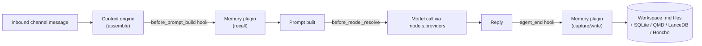
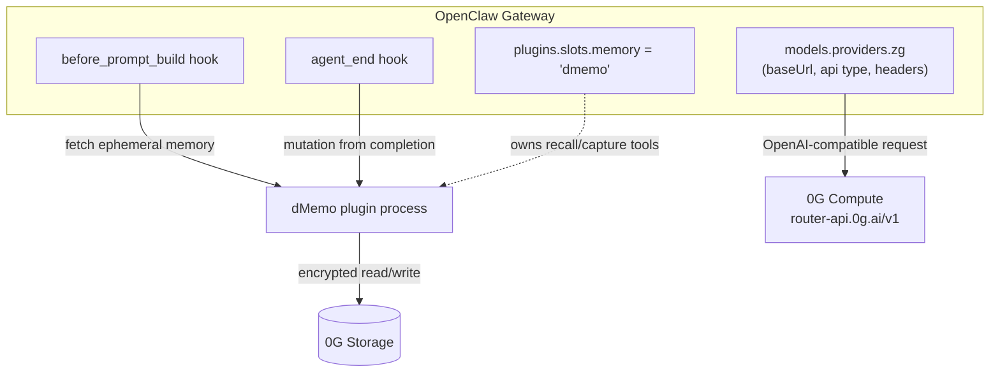

# OpenClaw — Research for dMemo Integration

**Scope:** runtime/SDK + custom model endpoints; native extension mechanisms; current memory storage and replaceability.

**Verified sources:**
- Repo: https://github.com/openclaw/openclaw (cloned to `/private/tmp/claude-501/-Users-tomasdomingos-dMemo/15587102-be28-4ef7-8ec7-35a0239acba5/scratchpad/repos/openclaw`, commit `ca8610151af280492c23af992956968bc9427d03`, 2026-07-24)
- Docs: https://docs.openclaw.ai/
- Website: https://openclaw.ai/ , org: https://github.com/orgs/openclaw/repositories
- License: MIT, "OpenClaw Foundation" (`LICENSE`, `package.json`)
- 0G Compute API shape: https://docs.0g.ai/developer-hub/building-on-0g/compute-network/router/overview

OpenClaw is a self-hosted, multi-channel AI agent gateway (WhatsApp/Telegram/Discord/Slack/iMessage/etc.) — not a coding-agent CLI. It runs an LLM agent loop, exposes 20+ chat channels, and ships a large first-party plugin/provider ecosystem (162 bundled `extensions/`). It is real, active, and has a formal plugin SDK — good fork/extension target.

---

## 1. High-level overview

### 1.1 Agent turn + where memory attaches today

### 1.2 Where dMemo would plug in

dMemo does not need a custom runtime fork: it is a standard OpenClaw **memory plugin** (owns `plugins.slots.memory`) that (a) calls 0G Storage for encrypted fetch/persist, and (b) OpenClaw's *existing* custom-provider config points model calls at 0G Compute's OpenAI-compatible router. No core OpenClaw changes required.

---

## 2. Runtime / SDK & custom model endpoints

| Question | Answer | Reference |
|---|---|---|
| Runtime | Node.js, `engines.node: ">=22.22.3 <23 \|\| >=24.15.0 <25 \|\| >=25.9.0"`; TypeScript throughout; pnpm workspace monorepo (`pnpm-workspace.yaml`) | `package.json:2-16`, `engines` block |
| Install | `npm install -g openclaw@latest && openclaw onboard --install-daemon`, or build from source (git + pnpm) | https://docs.openclaw.ai/ (fetched) |
| Plugin SDK package | `openclaw/plugin-sdk` (TS types + runtime), plugin entry via `definePluginEntry(...)` | `src/plugin-sdk/plugin-entry.ts`, `src/plugin-sdk/core.ts` |
| Custom model endpoints | **Yes, fully native.** `models.providers.<id>` accepts arbitrary `baseUrl`, `apiKey` (`${ENV_VAR}` expansion), `api: "openai-completions" \| "anthropic-messages"`, `headers`, per-model `contextWindow`/`maxTokens`/`cost` | `docs/concepts/model-providers.md:354-364` ("Providers via `models.providers` (custom/base URL)"), example block `docs/concepts/model-providers.md:649-711` ("Local proxies (LM Studio, vLLM, LiteLLM, etc.)") |
| Proxy-safe request shaping | For non-native OpenAI-compatible hosts, OpenClaw auto-disables OpenAI-only request shaping (service_tier, Responses `store`, prompt-cache hints, dev role) to avoid 400s on generic proxies | `docs/concepts/model-providers.md:698-707` |

**0G fit:** 0G's router (`router-api.0g.ai/v1`) is explicitly OpenAI-HTTP-compatible ("existing OpenAI SDK code works after a one-line base URL change... any tool that speaks the OpenAI API works with 0G Router"). That maps directly onto OpenClaw's documented custom-provider recipe: set `models.providers.zg.baseUrl`, `api: "openai-completions"`, `apiKey`, then `agents.defaults.model.primary: "zg/<model>"`. No custom OpenClaw code needed for the inference leg. (Source: https://docs.0g.ai/developer-hub/building-on-0g/compute-network/router/overview)

---

## 3. Native extension mechanisms (attach points for memory)

| Mechanism | Purpose | How it attaches | Reference |
|---|---|---|---|
| **Plugin hooks** | In-process lifecycle interception | `api.on("before_prompt_build", handler)` to inject recalled memory into the prompt; `api.on("agent_end", handler)` to capture the completion as a mutation | `docs/plugins/hooks.md:111-186` (full hook catalog), pattern used verbatim by the bundled Honcho plugin: "Honcho tools query the service during OpenClaw's `before_prompt_build` plugin hook, injecting relevant context before the model sees the prompt" — `docs/concepts/memory-honcho.md:104-106` |
| **Memory capability slot** | Exclusive "owner of memory" plugin slot | `plugins.slots.memory: "<plugin-id>"` — only one plugin owns recall/capture at a time; installing a new memory plugin auto-switches the slot and disables the prior owner | `docs/gateway/configuration-reference.md:390`; `docs/plugins/memory-lancedb.md:24-32` |
| **`api.registerMemoryCapability(...)`** | Deep integration API (what the default `memory-core` plugin uses) | Register `promptBuilder`, `flushPlanResolver`, `runtime` (search/get), `publicArtifacts`; plus `api.registerTool` for `memory_search` / `memory_get` tool names | `extensions/memory-core/index.ts:188-219` (`kind: "memory"`, `api.registerMemoryCapability({...})`) |
| **Context engine slot** | Controls what messages the model sees each turn (ingest/assemble/compact/afterTurn lifecycle); optional, separate from memory | `plugins.slots.contextEngine`; `assemble()` can return `systemPromptAddition` for dynamic recall guidance | `docs/concepts/context-engine.md:1-246` |
| **MCP — client** | Consume external MCP servers as agent tools (stdio / SSE / streamable-http, OAuth) | `openclaw mcp add/set/configure` registers servers into `mcp.servers`; tools surface directly to agent runtimes | `docs/cli/mcp.md:350-449` |
| **MCP — server** | OpenClaw exposes its own channel conversations over MCP to Claude Code / Codex / other clients | `openclaw mcp serve` (stdio bridge over the Gateway WebSocket) | `docs/cli/mcp.md:39-145` |
| **Provider plugins** | `registerProvider(...)` — for a fully custom request executor beyond `models.providers` config | `docs/concepts/model-providers.md:67-75`, `docs/plugins/sdk-provider-plugins.md` |

**Two viable integration depths for dMemo:**
1. **Shallow (Honcho pattern):** just `before_prompt_build` (recall) + `agent_end` (capture) hooks, no slot ownership — fastest to ship, coexists with other memory plugins.
2. **Deep (memory-core pattern):** own `plugins.slots.memory`, implement `registerMemoryCapability` + `memory_search`/`memory_get` tools — becomes *the* memory system, gets first-class CLI (`openclaw memory ...`), doctor diagnostics, and Control UI wiring. Given dMemo's "plug-and-play, replace the memory stack" goal, this is the natural target — it's exactly the seam `memory-lancedb` and `memory-honcho` already use as external npm plugins.

---

## 4. Where memory lives today, and replaceability

| Layer | Default | Notes |
|---|---|---|
| Source of truth | Plain Markdown in agent workspace: `MEMORY.md` (long-term), `memory/YYYY-MM-DD.md` (daily notes), `DREAMS.md` (consolidation review) | "The model only remembers what gets saved to disk; there is no hidden state." — `docs/concepts/memory.md:9-11` |
| Search index (default backend `builtin`) | Per-agent SQLite DB, `~/.openclaw/agents/<agentId>/agent/openclaw-agent.sqlite`, FTS5 keyword + vector (many embedding providers, incl. generic `openai-compatible`) | `docs/concepts/memory-builtin.md:62-99` |
| Alternate backends (already pluggable, ships today) | **QMD** (local sidecar, BM25+vector+rerank), **Honcho** (external service, self-host or hosted, cross-session AI-native memory), **LanceDB** (external plugin, vector DB, S3-compatible `storageOptions`) | `docs/concepts/memory.md:168-187`; `docs/concepts/memory-qmd.md`; `docs/concepts/memory-honcho.md`; `docs/plugins/memory-lancedb.md` |
| Replace/augment | **Yes — this is a designed extension point, not a hack.** `plugins.slots.memory` is single-owner and hot-swappable via plugin install; `memory-wiki` is documented as an example of an *augmenting* (non-owning) companion plugin that layers on top without taking the slot | `docs/plugins/memory-lancedb.md:24-32`; `docs/concepts/memory.md:189-207` (memory-wiki: "does not replace the active memory plugin... adds a provenance-rich knowledge layer beside it") |

Precedent for exactly dMemo's shape (external service, encrypted, fetched at runtime, non-local storage) is the **Honcho plugin**: install via npm, points `baseUrl` at a self-hosted or managed API, migrates existing workspace `.md` files non-destructively, and is a separate `@honcho-ai/openclaw-honcho` npm package rather than a core fork (`docs/concepts/memory-honcho.md:45-96`, source: https://github.com/plastic-labs/openclaw-honcho). dMemo can follow the same packaging model but back the store with 0G Storage instead of a Honcho-style server.

---

## 5. Key decisions & why

| Decision | Recommendation | Why (doc/code evidence) |
|---|---|---|
| Don't fork OpenClaw core | Ship dMemo as an installable plugin (`openclaw plugins install @<org>/openclaw-dmemo`) | Every memory backend variant in the ecosystem (LanceDB, Honcho, QMD-adjacent) ships this way; `plugins.slots.memory` exists precisely so no core changes are needed (`docs/plugins/memory-lancedb.md:24-27`) |
| Model routing to 0G Compute | Use native `models.providers` custom-baseUrl config, not a provider-plugin rewrite | 0G Router is OpenAI-HTTP-compatible; OpenClaw's `openai-completions` custom-provider path is documented for exactly this (local proxies / third-party OpenAI-compatible endpoints) — `docs/concepts/model-providers.md:649-711` |
| Recall injection | Use `before_prompt_build` hook to prepend fetched-and-decrypted memory as `prependSystemContext`/`systemPromptAddition`, then discard locally after the call | Matches Honcho's documented mechanism exactly (`docs/concepts/memory-honcho.md:104-106`); `before_prompt_build` is designed for "dynamic context or system-prompt text before the model call" (`docs/plugins/hooks.md:123`) |
| Mutation capture | Use `agent_end` hook (observation, post-completion) to turn the finished turn into a memory mutation and push to 0G Storage | `agent_end`: "Observe final messages, success state, and run duration" (`docs/plugins/hooks.md:127`); Honcho persists "After every AI turn" via the same class of hook |
| Own the memory slot vs. coexist | Own it (`plugins.slots.memory: "dmemo"`) for the plug-and-play pitch, but keep the plugin narrow enough that `memory-wiki`-style companions can still layer on top | Slot is exclusive by design but explicitly supports non-owning companions (`docs/concepts/memory.md:198-207`) |
| Tool surface | Register `memory_search` / `memory_get` (or equivalent) via `api.registerTool`, matching the two-tool convention every other backend uses | `docs/concepts/memory.md:141-149`; `extensions/memory-core/index.ts:213-219` |
| Config surface | Standard `plugins.entries.dmemo.config` block (apiKey/baseUrl/workspaceId pattern), not a bespoke config file | Matches Honcho's `plugins.entries.entries["openclaw-honcho"].config` shape (`docs/concepts/memory-honcho.md:64-82`) — keeps onboarding "plug and play" consistent with what OpenClaw users already expect |
| Fork base (D18) | Fork mem0's first-party `@mem0/openclaw-mem0` (`mem0/integrations/openclaw`) rather than authoring a plugin from scratch | Only first-party mem0 plugin with a real in-process OSS mode (`mem0ai/oss` `Memory`, SQLite vectors, better-sqlite3 resilience + vector-dim workarounds already solved), deterministic `before_prompt_build` recall in its default `smart` strategy, and a `dream` consolidation gate (file-lock + counters) worth porting; rationale detail in `followup-fork-bases.md` |
| Embedder/LLM wiring | Swap the fork's OSS defaults (which call OpenAI for both embedder and LLM) to dMemo's local embedder (D6) + 0G Router | Required adaptation on top of the fork — `@mem0/openclaw-mem0` ships OpenAI-backed defaults out of the box |

---

## 6. Open questions (not resolved by this research)

1. **0G Storage read/write latency at agent-turn scale.** OpenClaw's default hook timeout for `before_prompt_build` is configurable but defaults matter (`hooks.timeoutMs`, `docs/plugins/hooks.md:60-105|85-88`) — need to benchmark 0G Storage encrypted fetch against that budget, or increase `hooks.timeouts.before_prompt_build` explicitly.
2. **Multi-tenant / multi-agent workspace mapping.** OpenClaw supports multiple agents each with isolated workspaces and per-agent memory ownership (`docs/plugins/memory-lancedb.md:218-223` — "Every memory is owned by one agent"). The `@mem0/openclaw-mem0` fork base's `isolation.ts` already maps session keys to a `${userId}:agent:<agentId>` namespace, with subagents recalling from the parent scope and skipping capture — dMemo's per-agent encryption keys can follow the same namespace pattern; still worth a verification pass against `docs/concepts/multi-agent.md`.
