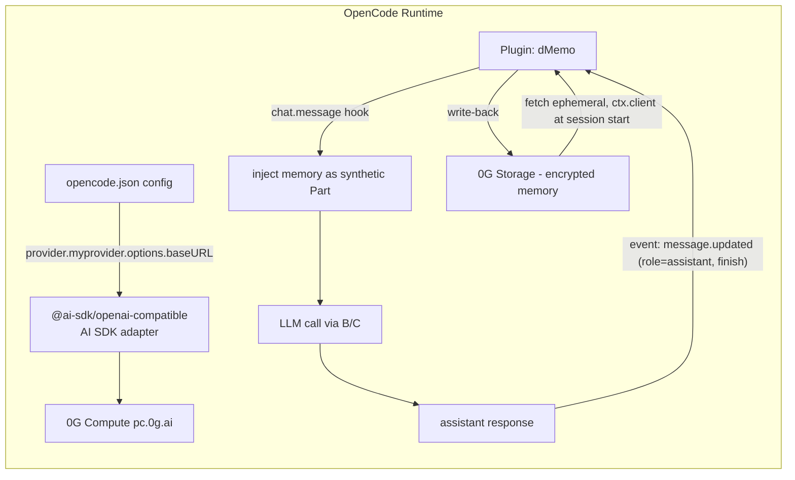

# OpenCode — Research for dMemo Integration

**Scope:** custom provider/baseURL routing (for 0G Compute), native memory attachment points (plugin/hook/MCP/config), and the fork base for dMemo's OpenCode plugin (D18).

**Repo status:** `github.com/sst/opencode` now returns HTTP 301 → canonical repo is **`github.com/anomalyco/opencode`** (org renamed; `sst/opencode` is a dead alias that still clones/redirects). Cloned at `/private/tmp/claude-501/.../scratchpad/repos/opencode` (HEAD `2b2aacc`, dated 2026-07-24). Docs source: `packages/web/src/content/docs/`.

---

## (a) High-level overview



Request/response path per turn:

```
user message
   └─ chat.message hook + chat.messages.transform fire — inject memory every turn
        └─ plugin fetches/decrypts memory from 0G Storage
        └─ unshift a synthetic text Part into output.parts  (invisible "[MEMORY] ..." block)
   └─ chat.params hook (optional) — could also tweak temperature/options here
   └─ request goes to provider configured with options.baseURL = 0G Compute endpoint
   └─ assistant reply streams back
   └─ event hook: message.updated (role=assistant, finish=true) → capture reply,
      deterministically every 3rd message, plus via the native compaction hook (below)
   └─ plugin encrypts + writes mutation to 0G Storage, discards local copy
```

---

## (b) Key decisions and why

### 1. Custom provider / baseURL → route through 0G Compute

**Decision:** Register 0G Compute as a **custom OpenAI-compatible provider** in `opencode.json` using the built-in `@ai-sdk/openai-compatible` adapter — no fork of OpenCode's provider code needed.

Evidence:
- `packages/web/src/content/docs/providers.mdx:2359-2440` ("Custom provider" section) — the fully documented, native path:
  ```json
  {
    "$schema": "https://opencode.ai/config.json",
    "provider": {
      "0g": {
        "npm": "@ai-sdk/openai-compatible",
        "name": "0G Compute",
        "options": { "baseURL": "https://pc.0g.ai/v1", "apiKey": "{env:ZEROG_API_KEY}" },
        "models": { "<model-id>": { "name": "..." } }
      }
    }
  }
  ```
  Note from the doc: use `@ai-sdk/openai-compatible` for `/v1/chat/completions`-style APIs; use `@ai-sdk/openai` if the endpoint is `/v1/responses`-style. Need to confirm which shape `pc.0g.ai` exposes.
- `packages/opencode/src/provider/provider.ts:355-358` — core resolves `options.baseURL` (or `options.endpoint`, which takes precedence) into the AI SDK client at runtime; this is the same mechanism every built-in provider (Bedrock, Azure, Vertex, etc.) uses, confirming it's a first-class, non-hacky path.
- Any provider (including custom ones) also supports `options.headers` and `{env:VAR}` interpolation for the API key — useful if 0G Compute auth requires custom headers rather than a bearer token.
- Also supports `blacklist`/`whitelist` to curate which 0G-hosted models show in `/models` (`providers.mdx:47-77`).

**Why native, not custom code:** this is literally in the docs as the intended extension point for "any provider not in the directory" — exactly dMemo's situation. No SDK patching required.

### 2. Memory attachment points — plugin hooks (native, not custom infra)

**Decision:** Ship dMemo as an **OpenCode plugin**. Lifecycle hooks cover the whole plug-and-play memory loop:

| Need | Hook | Source |
|---|---|---|
| Inject memory into context before LLM call, every turn | `"chat.message"` + `"chat.messages.transform"` — fires on new user message, receives mutable `output.parts` (and `output.message`) | `packages/plugin/src/index.ts:234-243` |
| Capture completion output for write-back | `event` hook subscribing to `message.updated` (filter `role==="assistant" && info.finish`), plus deterministic every-3rd-message capture | `packages/plugin/src/index.ts:224` |
| Detect idle session / trigger flush | `event` → `session.idle` | `packages/plugin/src/index.ts:224` |
| Provide a manual memory tool (`/remember`, `search`, etc.) to the agent | `tool: { <name>: ToolDefinition }` in the returned Hooks object | `packages/plugin/src/index.ts:226-228` |
| Modify LLM params (temperature, custom options) per call | `"chat.params"` | `packages/plugin/src/index.ts:247-256` |
| Modify/replace system prompt with injected memory instead of a synthetic user part | `"experimental.chat.system.transform"` | `packages/plugin/src/index.ts:291-296` |
| Hook into context-compaction/summarization to preserve memory across compaction, and persist the resulting summary as a new memory | `"experimental.session.compacting"` (native hook) | `packages/plugin/src/index.ts:222-335` |
| Sanitize/gate what tools can see or do (defensive, optional) | `"tool.execute.before"` / `"tool.execute.after"` | `packages/plugin/src/index.ts:266-281` |

**Compaction-trigger heuristic to reimplement on `experimental.session.compacting`:** token-ratio ≥0.80 of the context window **and** ≥50k tokens, with a cooldown between triggers, plus a `session.idle` catch-up flush for anything missed mid-session — good trigger math worth porting even though its origin (`opencode-supermemory` `compaction.ts:332-373,522-552`) bypasses the native hook and hand-writes message/part files instead.

Full `Hooks` interface: `packages/plugin/src/index.ts:222-335`.

Plugin loading is fully native — four sources, resolved in order, npm packages auto-installed via Bun at startup:
```
1. ~/.config/opencode/opencode.json  (global config: "plugin": [...])
2. ./opencode.json                   (project config)
3. ~/.config/opencode/plugins/       (global plugin dir, .js/.ts files)
4. .opencode/plugins/                (project plugin dir)
```
(`packages/web/src/content/docs/plugins.mdx:13-64`)

Plugin function signature: `(ctx: PluginInput, options?) => Promise<Hooks>` where `ctx` gives `{ client, project, directory, worktree, serverUrl, $ }` — `client` is a full OpenCode SDK client (session messages, summarize, promptAsync, tui.showToast, provider.list, etc.), enough to read model context limits and drive session state without any private API. (`packages/plugin/src/index.ts:56-74`)

**Why this beats MCP for the injection side:** an MCP server only exposes *tools* the model can choose to call — it doesn't guarantee memory is read every turn. The `chat.message` hook runs unconditionally before every request, matching "plug-and-play, zero prompting required" — this is exactly why mem0's `opencode-mem0.ts` uses `chat.message` + `chat.messages.transform`, not an MCP resource, for context injection.

**MCP is still useful as a secondary surface** — e.g. exposing memory CRUD as MCP tools for other agents (Claude Code, Codex) to share the same backing store, config native at `mcp` top-level key with `type: "local"|"remote"`, `enabled`, `headers`, `oauth` (RFC 7591 dynamic client registration supported) (`packages/core/src/v1/config/mcp.ts:1-64`, `packages/web/src/content/docs/mcp-servers.mdx`). Not needed for the core injection loop.

### 3. Fork base: mem0's `opencode-mem0.ts` (D18)

**Decision:** Fork `mem0-plugin/.opencode-plugin/opencode-mem0.ts` outright. (dMemo forks mem0 OSS rather than supermemory across every host because supermemory's engine is closed-source, while mem0's is Apache-2.0 and embeddable in-process — the reason for the project's mem0 pivot.) The plugin already wires memory injection every turn (`chatMessageHook` + `chat.messages.transform`, `opencode-mem0.ts:630-886`), deterministic capture, and the OpenCode plugin scaffolding dMemo needs.

Changes required:
- Replace `new MemoryClient({apiKey})` (`opencode-mem0.ts:279`, single instantiation site) with the in-process OSS `Memory` class plus the D7 journaling `VectorStore` wrapper.
- Strip 4 Platform-only tool integrations: `autoSetupCategories`, `delete_entities`, `list_entities`, `get_event_status` (`opencode-mem0.ts:139-173,580-626`).
- Rewrite `resolveFilters`/`scope.ts` from the Platform `{AND:[…]}` REST DSL to OSS `SearchFilters`.

Everything else — the `chat.message`/`chat.messages.transform` injection wiring, the manual memory tool template, and the native `experimental.session.compacting` integration point — carries over unmodified.

---

## (c) Summary table

| Question | Answer | Confidence |
|---|---|---|
| Custom provider/baseURL for 0G routing? | Yes, native — `provider.<id>.npm: "@ai-sdk/openai-compatible"` + `options.baseURL`/`options.headers`/`{env:...}` | High, docs + code confirmed |
| Native memory-injection hook? | `"chat.message"` + `"chat.messages.transform"` (Hooks interface) — inject every turn, mutate `output.parts` | High, type-checked interface in `packages/plugin/src/index.ts` |
| Native write-back/capture hook? | `event` hook on `message.updated` (assistant+finish), deterministic every-3rd-message capture, and `session.idle` catch-up, driven via SDK `client.session.messages()` | High |
| MCP servers config? | Native `mcp` top-level config key, local/remote, OAuth-capable | High, schema in `packages/core/src/v1/config/mcp.ts` |
| Fork base for dMemo's OpenCode plugin? | mem0's `opencode-mem0.ts` — swap `MemoryClient` for in-process OSS `Memory` + D7 wrapper, strip 4 Platform-only tools, rewrite filter DSL (D18) | High |

---

## Open questions (unresolved)

1. **0G Compute API shape** — need to confirm whether `pc.0g.ai` exposes `/v1/chat/completions` (→ use `@ai-sdk/openai-compatible`) or `/v1/responses` (→ use `@ai-sdk/openai` per the docs' explicit guidance at `providers.mdx:2429`). This determines which `npm` adapter value to put in the custom provider config.
2. **Auth scheme for 0G Compute** — bearer API key vs. wallet-signature/header-based auth (0G's compute broker model sometimes uses request signing rather than a static key). If it's not a static bearer token, the plugin may need a `"chat.headers"` hook (`packages/plugin/src/index.ts:257-260`) to sign each request rather than relying on `options.apiKey`.
3. Did not verify whether forking and renaming `opencode-mem0.ts` breaks anything version-sensitive in its packaging/registration flow — worth a quick smoke test before committing to fork-and-rename as the ship strategy.
